

# *Submitted by*:
|              Name              |   Sec. | B.N.|
|:------------------------------:|:------:|:---:|
| Aya Abdullah Farag             |    1   | 19
| Aya Mohamed Abdulrazzaq        |    1   | 20
| Rania Atef Omar                |    1   | 31 
| Salma Haytham                  |    1   | 37
| Nouran Khaled                  |    2   | 41

contact email: nkhaledsoliman@gmail.com
____________________________
 
 

# 1- Harris corner detection

## *Outputs Samples* :

  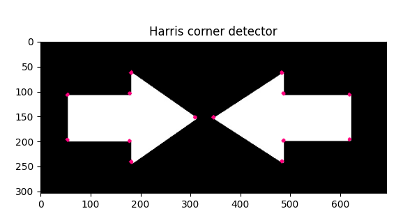
  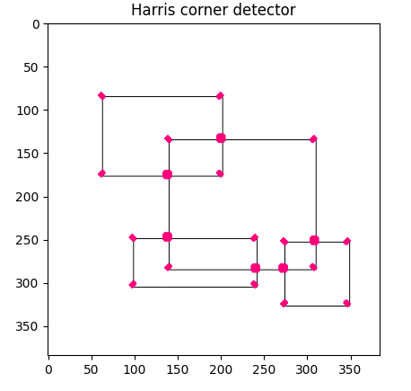 
   
  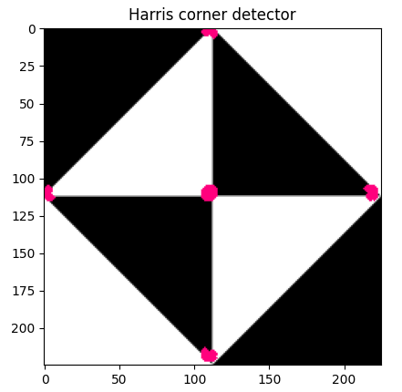 

# 2- SIFT 

##main_functions:
1. scale_space() constructs the scale space of the image and the DOGs images of each octave 
2. locate_keypoints() locate keypoints from dog images in each octave and filter out low contrast and edge pixels
3. keypoints_orientation () appends orientation angle for keypoints
4. sift_descriptors() generate feature descriptor vectors for the keypoints

## *Outputs Samples* :
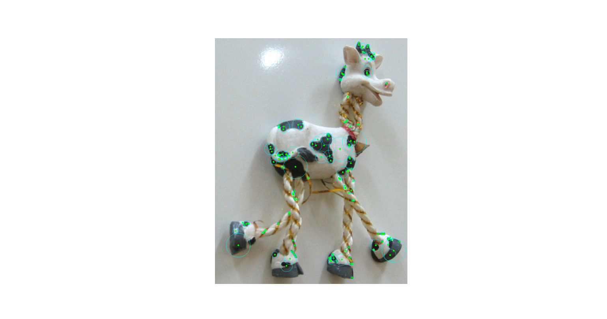 

### lowering contrast threshold , more keypoints are added

  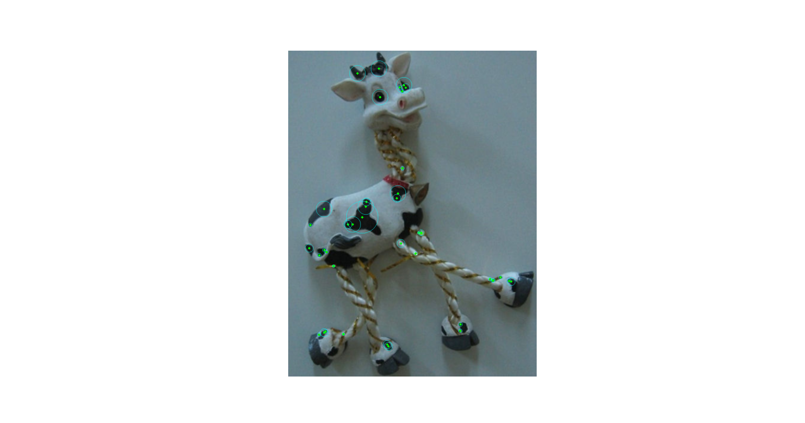 
  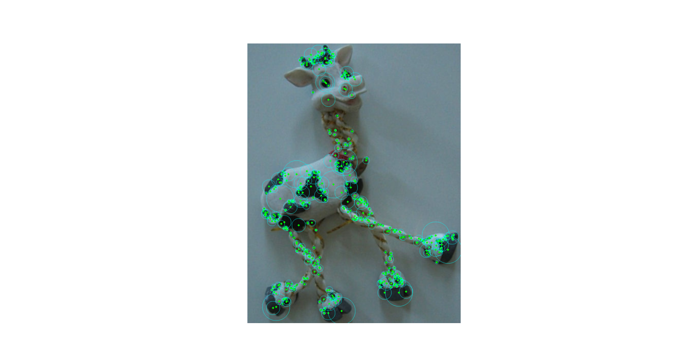 

  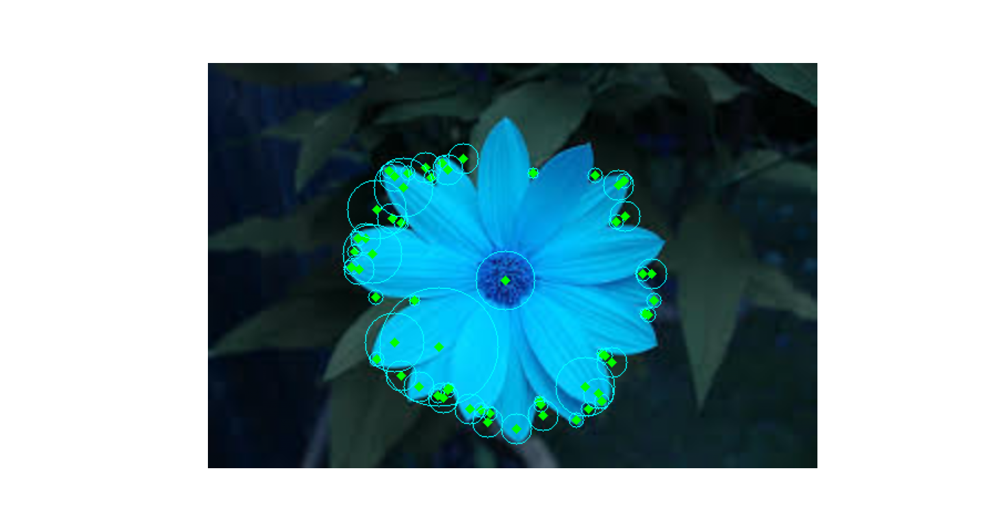 
  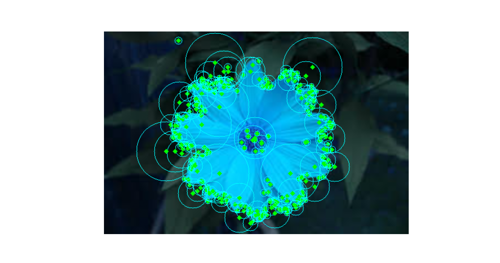 

## Harris vs SIFT

#### 5.5 seconds - 7.2 secons

  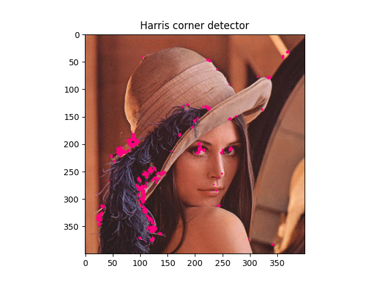 
  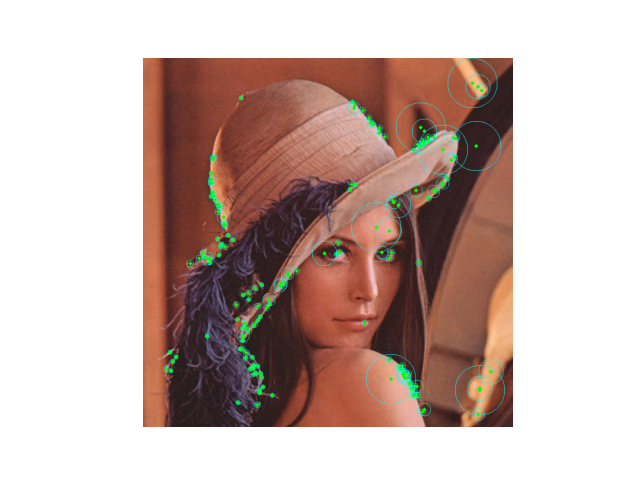 

# 3- Feature_Matching

##main_functions:
1. sum squared difference() to minimize the difference 
2. normalized cross correlation() to maximize the corrrelation
3. apply_feature_matching() to Create a cv2.DMatch object 

## *Outputs Samples* :

  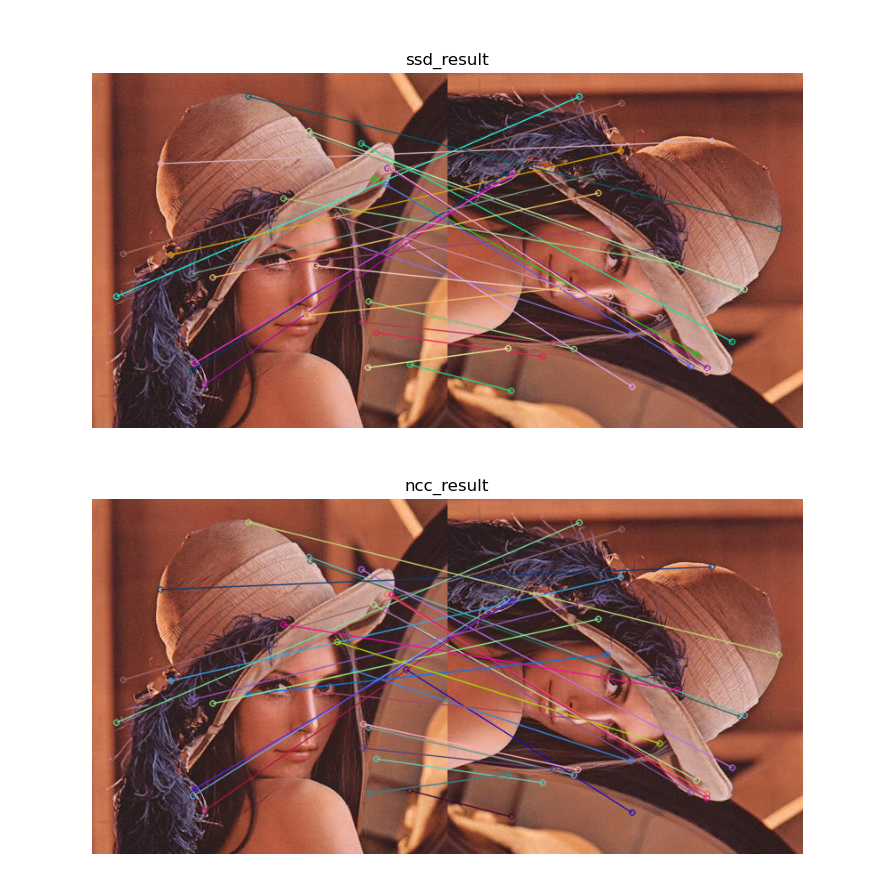 

