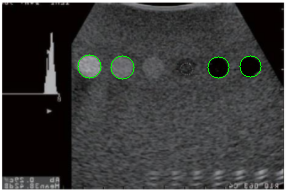
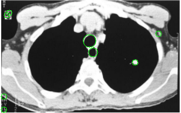
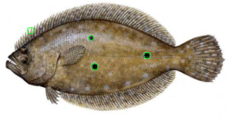
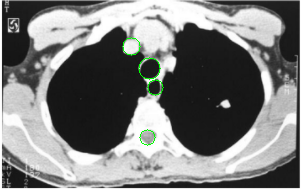
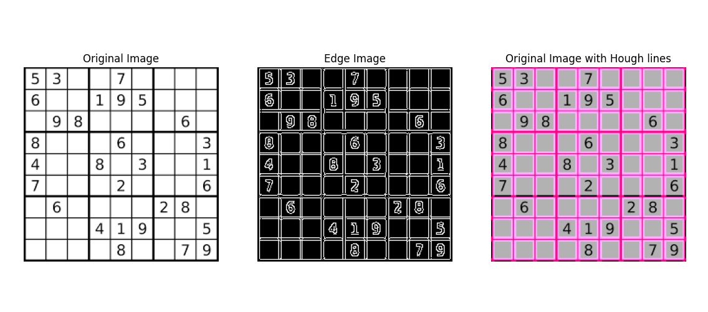
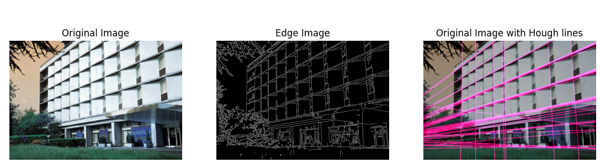
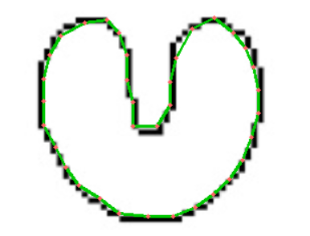
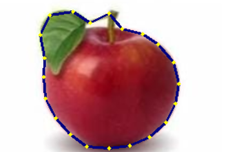

# *Submitted by*:
|              Name              |   Sec. | B.N.|
|:------------------------------:|:------:|:---:|
| Aya Abdullah Farag             |    1   | 19
| Aya Mohamed Abdulrazzaq        |    1   | 20
| Rania Atef Omar                |    1   | 31 
| Salma Haytham                  |    1   | 37
| Nouran Khaled                  |    2   | 41

____________________________
 
 

# 1- Detect Lines, Circles, Ellipses
# Circle detection
- Using Hough transform with 3d accumulator . delta radius and thetas , threshold percentage can be set , Only circles that exceeds thresold percentage are detected ,also very close circles are ignored

  
   
  

## Different range of radius setting 
 

  
   

# lines detection

  
   

# 2- Active contour

   
  

