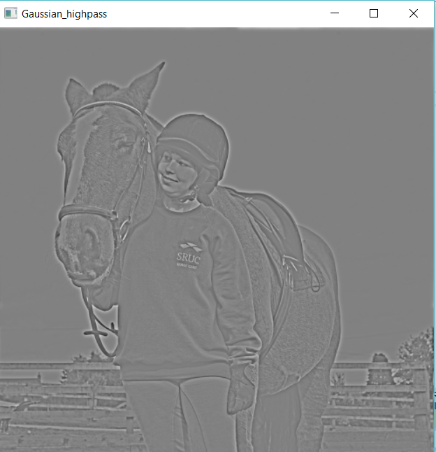

# *Submitted by*:
|              Name              |   Sec. | B.N.|
|:------------------------------:|:------:|:---:|
| Aya Abdullah Farag             |    1   | 19
| Aya Mohamed Abdulrazzaq        |    1   | 20
| Rania Atef Omar                |    1   | 31 
| Salma Haytham                  |    1   | 37
| Nouran Khaled                  |    2   | 41

____________________________
 
 

# 1-Adding additive noise 
Noise is generally considered to be a random variable . Consider a noisy pixel, p=p0+n where p0 is the true value of pixel and n is the noise in that pixel. 
Here, we add three basic types of noise that are common in image processing applications:

- Gaussian noise.
- Uniform noise
- Salt and Pepper noise 

## *Outputs Samples* :
### Gaussian noise 
Gaussian noise has a uniform distribution throughout the signal. A noisy image has pixels that are made up of the sum of their original pixel values plus a random Gaussian noise value. The probability distribution function for a Gaussian distribution has a bell shape.
This type of noise adds more Noise to the midtones and less noise to the shadows and highlight regions of the image.

  
   
  

### Uniform noise
 As the name suggests, using this option adds random colour noise of equal intensity all over the image. it means the different “values” of noise are equally probably.

  
   
  

### Salt and Pepper noise 
A type of noise commonly seen in photographs is salt and pepper noise. It manifests as white and black pixels that appear at random intervals. 

  
   

# 2-Filters
Filter_Noise function smooth the image and reduce high frequency components (Noise). It implements : Average , Gaussian , Median filters with adjustable kernel size and standard deviation
## Common Algorithm:
- Creating kernel
- Zero padd the image 
- Convolve kernel with the image 

## *Outputs Samples* :
### Median filter applied on salt & pepper noise , with kernel size 3 and 5 

  
   
  

### Gaussian filter kernel size = 5 , std = 1 // kernel size 3 , std = 5  

   
  
   
  

### Average filter kernel size = 5 , std = 1 // kernel size 3 , std = 5  

   
  
  

# 3- Edge Detection
DetectEdges function implements 4 Edge detection masks: Sobel , Roberts , Prewitt and Canny 
## Common Algorithm:
- Convert image to grey scale 
- Apply gaussian filter to smooth the image out
- Define kernels 
-Convolution 

## Canny edge detection:
### - canny filter works by:
- Convert image to grey scale 
- Apply gaussian filter 
- Apply Sobel filter
- Aply non max suppresion algorithm
- Double thresholding for defining weak and strong edges 
- Hysterisis 

## *Outputs Samples* :
### Canny:  

#### Canny Algorithm Output : Sobel , non max , thresholded image , hysterisis 

   
  
  
  

### Sobel:

### Roberts:

### Prewitt:

# 4&8-Histogram

Breaking this up into 2 functions - imhist() and im_rgbhist(). Each would has a double loop where we add up values in the different vector color arrays and generate the Histogram Plot images, create the windows and show the images.

  ## *Output Samples*:

  
  

# 5-Image_Equalization
histogram qualitation improves the contrast of images by clustering the pixels and flattinning the curve of histogram  -applying it in gray and color.

  ## *used functions*:
   1- imhist()
   2-cumhist()
   3-equalization_Algorithm_GRAYSCALE()
   4-equalization_Algorithm_COLOUR()

 ## *Outputs Samples* :

    
    
    
    

   
# 6-Image Normalization
This is another technique to enhance contrast. It is done by stretching the histogram to take all values.

 ## *Output* ##

# 7-Thresholding
Separate out regions of an image corresponding to objects which we want to analyze. This separation is based on the variation of intensity between the object pixels and the background pixels.
## *Outputs Samples* :

   

  
   
  
  

# 9-Frequency Domain Filters
 we can choose the desired filter and D0 by using *function Construct_H* which applied in the  Frequency_Domain Filters file .
  ## *Low pass filter*: H(u,v)
   reduces the high frequency content(blurring or smoothing)
   passes all frequencies withn a circle of radius from the origin and cut off all frequencies outside the circle.

  ## ideal_lowpass: D0 is a constant
     

  ## the equation D of ideal:
  

  ## Gaussian_lowpass: 
   

  ## equation of gaussian:
   

  ## *High pass filter*:  1 - H(u,v)
  sharpening the images 

  ## *Outputs Samples* :

  ##original in GRayscale:

    

  ##IDEAL_LOW ,,,, D0=30

   

  ##IDEAL_LOW ,,,, D0=85

       

  ##GAUSSIAN_LOW ,,,, D0=30

      

  ##GAUSSIAN_LOW ,,,, D0=85

      
 
  ##IDEAL_HIGH ,,,, D0=15

  

  ##IDEAL_HIGH ,,,, D0=30

    

  ##GAUSSIAN_HIGH ,,,, D0=15

  

  ##GAUSSIAN_HIGH ,,,, D0=30

    

 
 

# 10- Hybrid Images

 ## *First Image* ##
 

 ## *Second Image* ##
 

 ## *Zoomed In Output* ##
 

 ## *Zoomed Out Output* ##
 

 
  

