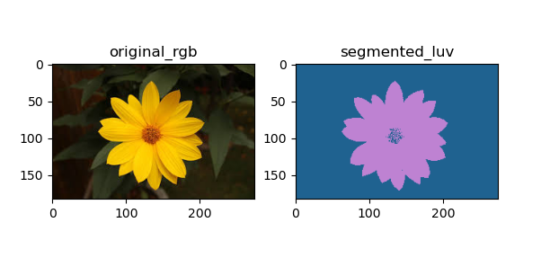
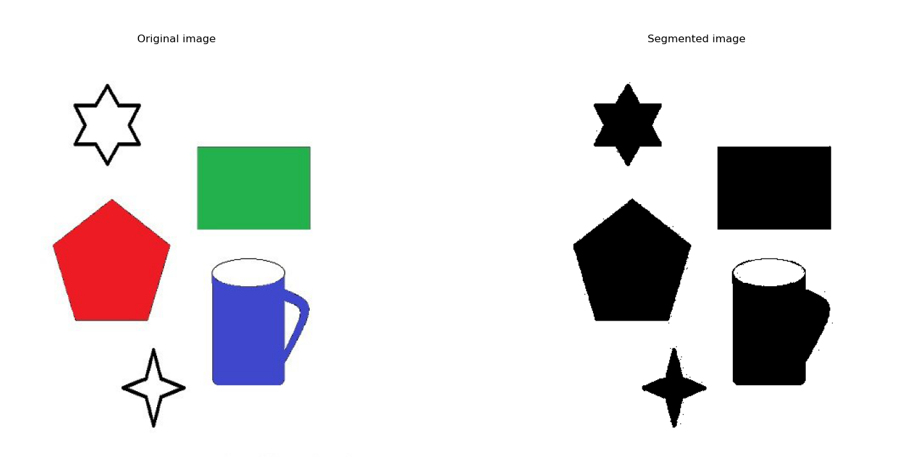
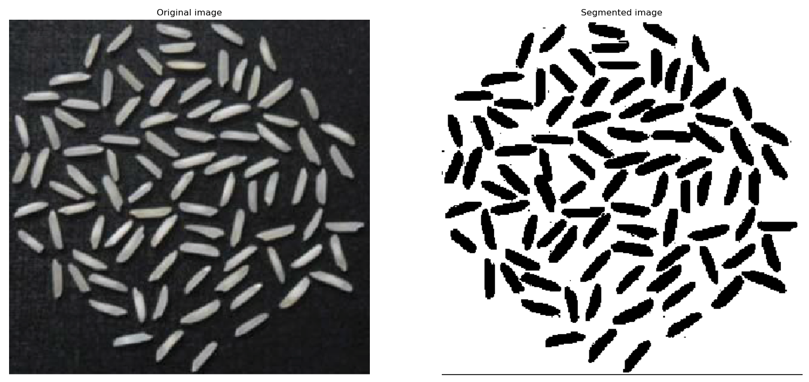
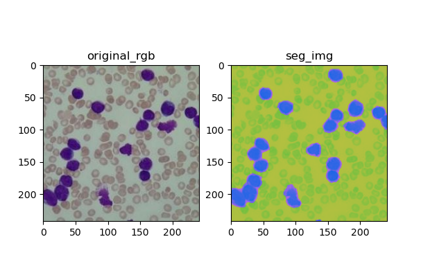

### *Submitted By:*
|              Name              |   Sec. | B.N.|
|:------------------------------:|:------:|:---:|
| Aya Abdullah Farag             |    1   | 19
| Aya Mohamed Abdulrazzaq        |    1   | 20
| Rania Atef Omar                |    1   | 31 
| Salma Haytham                  |    1   | 37
| Nouran Khaled                  |    2   | 41

## K-Means Segmentation

The K-means clustering algorithm computes centroids and repeats until the optimal centroid is found. 
It is presumptively known how many clusters there are. The number of clusters found from data by the method is denoted by the letter 'K'
 in K-means.
 
 **the applied Fuctions to implement the algorithm**
 1. distance_calc(a,b) ---> to take the centroid and image_pixels ad get the distance_calc
 2. closest_centroids(c, im) ----> to assign the minimum distance to make the clusters
 3. centroids_update(clusters, im) --->now we need a function to update the centroids by gettig the mean of img and use it till converge  

**problems**

choosing the suitable k(clusters ) to segment the different images as better we need and to be suffcient

### Output Sample

## Region Growing Segmentation

Region growing is an image segmentation method refers to starting from a certain pixel, according to certain criteria, gradually adding adjacent pixels. When certain conditions are met, region growth stops.

The quality of regional growth depends on 
1. The selection of initial point (seed point). 
2. Growth criteria. 
3. Termination conditions.

The basic idea of region growing is to assemble pixels with similar properties to form regions. 

Firstly, a seed pixel is found for each region to be segmented as the growth starting point, and then the seed pixel and the pixels in the surrounding neighborhood that have the same or similar properties as the seed pixel are merged into the region where the seed pixel is located. 

These new pixels are treated as new seeds to continue the above process until pixels that do not meet the conditions can be included.

### Results

## Mean_Shift segmentation

The Mean Shift segmentation is a local homogenization technique that is very useful for damping shading or tonality differences in localized objects.
An image region is defined by all the pixels associated with the same mode in the joint domain.
The clusters are separated by the boundaries of the basins, and the value of all the pixels within are set to their average.

**the applied Fuctions to implement the algorithm**
1. makeColorDataSpace() --->> make data space to reshape the image
2. classifyColors()   
3. findCenterMass(self, window) -->Moment around column and row
4. windowIter(self, row, col)
5. applyMeanShift()

### Output Sample
